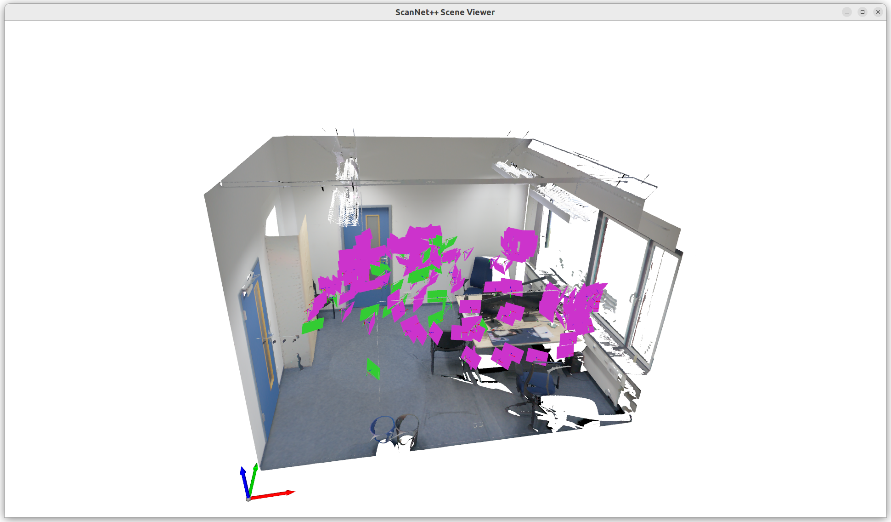

# 3D Gaussian Splatting on ScanNet++ Dataset
This repository contains the code for training and evaluating 3D Gaussian Splatting on the ScanNet++ dataset. The code is based on the original 3D Gaussian Splatting [repository](https://github.com/graphdeco-inria/gaussian-splatting) and has been adapted to work with ScanNet++.

## Requirements
The code has been tested with Python 3.9 + cuda 11.8 and requires the following packages:
```
git clone --recursive https://github.com/scannetpp/3DGS-demo 3dgs-demo
cd 3dgs-demo

conda create -n 3dgs-demo python=3.9
conda activate 3dgs-demo

conda install pytorch==2.3.1 torchvision==0.18.1 pytorch-cuda=11.8 -c pytorch -c nvidia

pip install submodules/diff-gaussian-rasterization
pip install submodules/simple-knn
pip install opencv-python plyfile tqdm open3d
```


## Dataset Preparation
Apply for and download the [ScanNet++ dataset](https://kaldir.vc.in.tum.de/scannetpp/). After downloading, the dataset should be organized as follows:
```
scannet_download
├── data
│   ├── SCENE_ID1
│   ├── SCENE_ID2
│   ├── SCENE_ID3
├── metadata
└── splits
```
**NOTE**: This code is based on undistorted DSLR images. These are automatically provided if you download the dataset using the updated download script after **2025-04-30**. Otherwise, you can undistort the images manually using the script `scannetpp_tools/dslr/undistort.py`, following the [official instruction](https://github.com/scannetpp/scannetpp?tab=readme-ov-file#undistortion-convert-fisheye-images-to-pinhole-with-opencv).

Expected directory format:
```
scene_id/dslr
├── colmap
├── nerfstudio
│   └── transforms_undistorted.json
├── resized_undistorted_images
└── resized_undistorted_masks
```

## Visualization

To visualize camera poses and meshes, use the provided viewer script. Ensure that Open3D is installed:
```sh
python viewer.py \
    --data_root [SCANNET++ DATA ROOT] \
    --scene_id [SCENE_ID] \
    --load_camera \
    --load_mesh
```

This will load the camera poses and the mesh for the specified scene ID and visualize them using Open3D, as shown below:




## Running
To train 3DGS on a scene from the ScanNet++ dataset, run:

```sh
python train.py \
    --data_root [SCANNET++ DATA ROOT] \
    --output_path [OUTPUT DATA ROOT] \
    --scene_id [SCENE_ID]
```

At the end of training, the rendered test images will be saved in the `[OUTPUT DATA ROOT]/submission` folder, following the [official submission format](https://kaldir.vc.in.tum.de/scannetpp/benchmark/docs). Once you have results for all test scenes, this folder can be then zipped and submitted to the ScanNet++ NVS benchmark server.


## Evaluation
To evaluate the results (on validation sets), you can use the provided evaluation script in `scannetpp_tools` (part of the [ScanNet++ Toolbox](https://github.com/scannetpp/scannetpp?tab=readme-ov-file#novel-view-synthesis-evaluation-dslr)).
```sh
cd scannetpp_tools
# Evaluate on a single scene
python -m eval.nvs \
    --data_root [SCANNET++ DATA ROOT] \
    --scene_id [SCENE_ID] \
    --pred_dir [OUTPUT DATA ROOT]/submission

# Evaluate on the entire validation set
python -m eval.nvs \
    --data_root [SCANNET++ DATA ROOT] \
    --split [SCANNET++ SPLIT]/nvs_sem_val.txt \
    --pred_dir [OUTPUT DATA ROOT]/submission
```